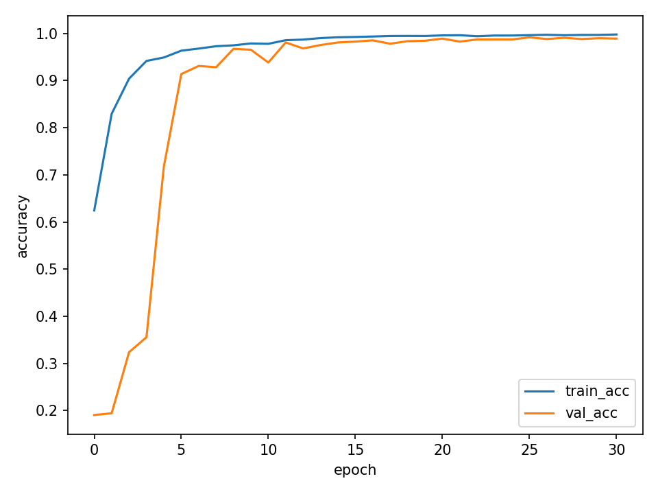
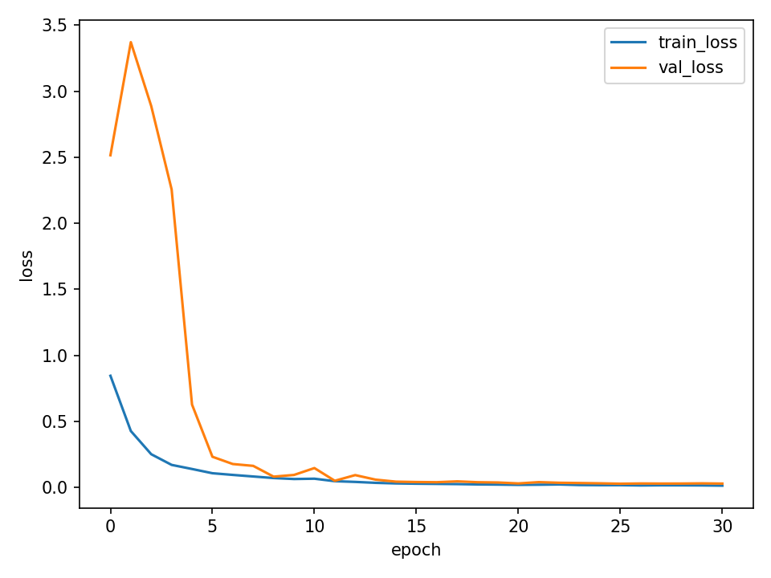
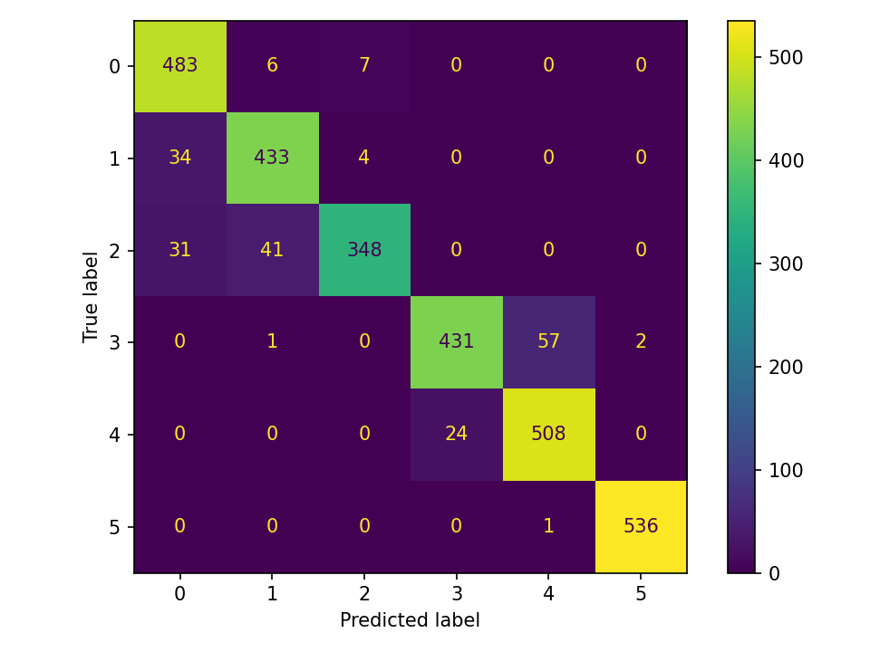
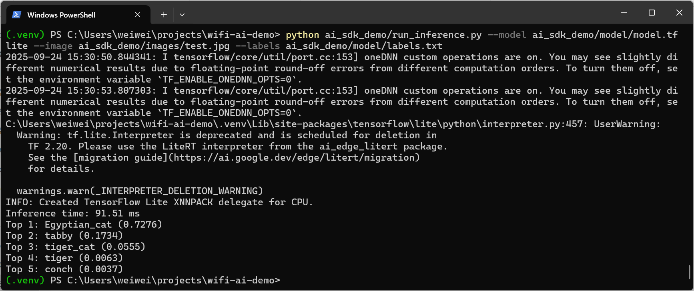

# AI for Wi-Fi Applications Demo

這個專案展示了 **AI SDK 部署** 與 **Wi-Fi sensing 應用** 的實作範例，呼應無線產品中 AI 的可能應用場景。  
包含兩個部分：  
1. **Wi-Fi Sensing Demo (UCI HAR dataset)**：展示資料前處理、模型訓練、匯出 TFLite
2. **AI SDK 部署 Demo (Image Classification)**：展示如何使用 AI SDK 在 Edge 裝置上進行 TFLite 推論

> 關聯性說明：Wi-Fi Sensing 部分展示**時序感測資料的模型訓練與匯出**；AI SDK Demo 展示**在 Edge 裝置上以 TFLite 執行推論**。兩者合起來，對應無線產品 AI 化的實作流程：模型開發 → 輕量化 → 部署與推論。


---

## 專案結構
```
wifi-ai-demo/
├─ ai_sdk_demo/                        # AI SDK 部署 Demo（影像分類，TFLite）
│  ├─ images/                          # 測試圖片（例：test.jpg）
│  ├─ model/                           # *.tflite / labels.txt
│  └─ run_inference.py                 # 載入 `.tflite` + `labels.txt` 做影像推論
│
├─ wifi_sensing_demo/                  # Wi-Fi Sensing / HAR 訓練與部署
│  ├─ data/                            # processed.npz 存放處
│  ├─ model/                           # 訓練輸出（h5 / tflite / 圖）
│  └─ train_eval.py                    # 訓練/早停/匯出/畫圖/評估
│
├─ tools/                              # 工具腳本
│  ├─ export_mobilenet.py              # 匯出模型
│  ├─ get_imagenet_labels.py           # 下載 labels
│  └─ uci_har_to_processed.py          # UCI HAR → processed.npz 轉檔
│
├─ demo_output/                        # Demo 截圖 (ai-sdk-result.png ...)
│
├─ requirements.txt                    # 相依套件
└─ README.md                           # 專案說明文件

```

---

## 環境安裝
建議 Python **3.11**。

```bash
python -m venv .venv
# Windows
.\.venv\Scripts\activate

pip install --upgrade pip
pip install tensorflow numpy matplotlib scikit-learn pillow
```
---

## Wi-Fi AI Demo

端到端範例：**Wi-Fi Sensing / HAR 訓練與部署** + **AI SDK 影像推論 Demo**。  
重點包含：資料轉檔 → 1D-CNN 訓練（EarlyStopping）→ 匯出 Keras/TFLite → Demo 推論。

---

### 訓練資料來源

#### UCI HAR Dataset
- 官方頁：<https://archive.ics.uci.edu/ml/datasets/human+activity+recognition+using+smartphones>  
- 下載 ZIP：<https://archive.ics.uci.edu/ml/machine-learning-databases/00240/UCI%20HAR%20Dataset.zip>  
- 內容：561 維特徵、6 類活動；官方已切 train/test。

- 下載與解壓：
```powershell
mkdir data_uci_har
Invoke-WebRequest -Uri "https://archive.ics.uci.edu/ml/machine-learning-databases/00240/UCI%20HAR%20Dataset.zip" -OutFile data_uci_har\UCI_HAR_Dataset.zip
Expand-Archive -Path data_uci_har\UCI_HAR_Dataset.zip -DestinationPath data_uci_har -Force
```

- 轉成 processed.npz：
```bash
python tools/uci_har_to_processed.py
```

#### 分類類別對應表（UCI HAR 六類活動）

| Label ID | Activity             | 說明       |
|----------|----------------------|-----------|
| 0        | WALKING              | 走路       |
| 1        | WALKING_UPSTAIRS     | 上樓梯     |
| 2        | WALKING_DOWNSTAIRS   | 下樓梯     |
| 3        | SITTING              | 坐著       |
| 4        | STANDING             | 站立       |
| 5        | LAYING               | 躺下       |

---

### Wi-Fi Sensing 訓練與匯出
- 訓練
```bash
python wifi_sensing_demo/train_eval.py --epochs 100
```
- 輸出：
`csi_cnn.h5`, `csi_cnn.tflite`, `training_curve.png`, `confusion_matrix.png`

- 快速測試（合成資料）：
```bash
python wifi_sensing_demo/train_eval.py --use_synthetic 1 --epochs 50
```

---

### Wi-Fi Sensing 實驗成果
- **Test Accuracy**：92.94%（UCI HAR，1D-CNN）

#### 輸出模型
  - `wifi_sensing_demo/model/csi_cnn.h5`
  - `wifi_sensing_demo/model/csi_cnn.tflite`

#### 學習曲線




#### 混淆矩陣

> 解讀：**走路(0)/上下樓梯(1,2)** 之間最易混淆；**坐著(3)/站立(4)** 有少量互判；**躺下(5)** 幾乎完全正確。
> 動態動作（走路、上下樓梯）因加速度特徵相近，最容易互相混淆。

---

## AI SDK 部署 Demo（影像分類）
> 此 Demo 使用 MobileNetV2 (ImageNet Pretrained, TFLite) 作為展示，主要目的在於驗證 AI SDK 推論流程。


### 功能
- 載入 TFLite 模型（`.tflite`）與標籤（`labels.txt`）
- 對單張影像分類，輸出 **Top-K 類別與機率**
- 支援 CPU (XNNPACK)；可延伸到 NPU delegate

### 取得模型與標籤
```bash
# 匯出/下載 TFLite 模型
python tools/export_mobilenet.py --output ai_sdk_demo/model/model.tflite

# 下載 ImageNet 類別標籤
python tools/get_imagenet_labels.py --out ai_sdk_demo/model/labels.txt
```

### 執行
```bash
python ai_sdk_demo/run_inference.py   --model ai_sdk_demo/model/model.tflite   --image ai_sdk_demo/images/test.jpg   --labels ai_sdk_demo/model/labels.txt   --top_k 5
```

---

### AI SDK 部署 Demo 實驗成果
#### Top-5 分類結果：
```
INFO: Loaded TFLite model (XNNPACK)
Inference time: 91.51 ms
Top 1: Egyptian_cat (0.7276)
Top 2: tabby (0.1734)
Top 3: tiger_cat (0.0555)
Top 4: tiger (0.0063)
Top 5: conch (0.0037)
```

#### Demo 圖：

---

## 👤 作者
- Name: SarikaChen 
- Email: sarika.chen0723@gmail.com  
- LinkedIn: https://www.linkedin.com/in/ling-wei-chen-542a42268/
- GitHub: https://github.com/SarikaChen
